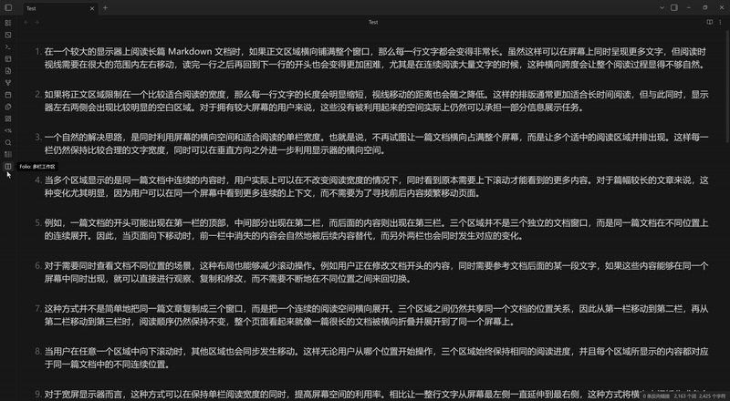
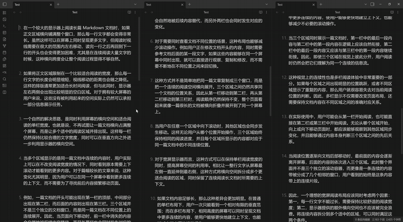
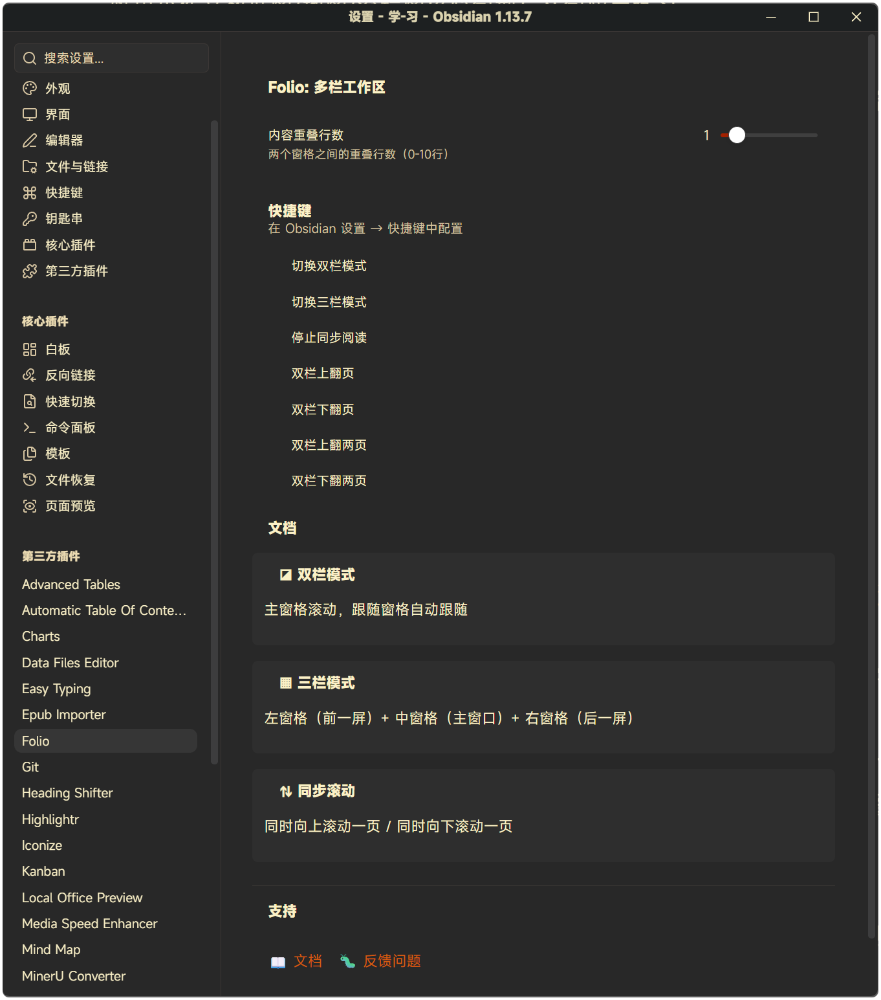

# MultiFolio

[English](../../README.md) | [简体中文](README.zh.md) | [繁體中文](README.zh-TW.md) | [日本語](README.ja.md) | [한국어](README.ko.md) | [Français](README.fr.md) | [Deutsch](README.de.md) | [Español](README.es.md) | [العربية](README.ar.md)

**MultiFolio：多栏工作区** —— Obsidian 中为无缝阅读与编辑而生的连续多栏工作空间。

- **双栏模式**：当前视图 + 下一屏，滚动同步
- **三栏模式**：上一屏 + 当前 + 下一屏，编辑时拥有完整上下文
- 编辑、预览、源码模式均可用

## ✨ 功能特性

### 📖 双栏模式
- 左侧为**主视图**，右侧为**下一屏**
- 滚动同步
- 适合连续阅读

### 📚 三栏模式
- 左侧为**上一屏**，中间为**主视图**，右侧为**下一屏**
- 当前位置的前后内容一目了然
- 编辑时拥有完整上下文

### ⚡ 智能同步
- 实时双向滚动同步
- 支持编辑、预览、源码模式
- 栏间重合行数可调（0–10 行）
- 模式无缝切换

### 🎮 简单易用的控制
- 工具栏图标 + 模式选择菜单
- 快捷键支持
- 一键切换模式
- 关闭分栏时自动清理

## 📦 安装

### 从 Obsidian 社区插件安装
1. 打开 设置 → 第三方插件
2. 搜索 "MultiFolio"
3. 安装并启用

### 手动安装
1. 从 [GitHub Releases](https://github.com/liyifan2004/obsidian-folio/releases) 下载最新版本
2. 解压到 `.obsidian/plugins/`
3. 在 设置 → 第三方插件 中启用

## 🚀 使用方法

### 工具栏菜单
点击左侧工具栏的 ◪ 图标打开 MultiFolio 的模式选择菜单：

- **双栏模式** —— 主视图 + 右侧跟随栏
- **三栏模式** —— 左右跟随栏 + 主视图
- **停止** —— 关闭所有跟随栏

### 命令
所有命令都可以在命令面板（Ctrl/Cmd + P）中找到：

| 命令 | 说明 |
|---------|-------------|
| Toggle Dual Pane Mode | 启用/禁用双栏工作区 |
| Toggle Triple Pane Mode | 启用/禁用三栏工作区 |
| Stop MultiFolio Workspace | 关闭所有工作区分栏 |
| Page Up | 向上滚动一页 |
| Page Down | 向下滚动一页 |
| Double Page Up | 向上滚动两页 |
| Double Page Down | 向下滚动两页 |

### 推荐快捷键
- **双栏模式**：`Ctrl/Cmd + Shift + D`
- **三栏模式**：`Ctrl/Cmd + Shift + T`
- **停止 MultiFolio**：`Ctrl/Cmd + Shift + Q`
- **上一页**：`Ctrl/Cmd + ↑`
- **下一页**：`Ctrl/Cmd + ↓`

## ⚙️ 设置

### 内容重合
调整分栏之间的重合行数（0–10 行）：
- **0**：无重合，翻页边界清晰
- **2–3**：推荐的流畅阅读值
- **5–10**：更强的上下文连续性

### 语言
界面语言自动跟随 Obsidian 设置（English、简体中文 / 繁體中文、日本語、한국어、Français、Deutsch、Español、العربية）。

## 🎯 使用场景

### 写作者
- 写作时看到前文语境
- 预览后续章节
- 在长文档中保持叙事连贯

### 读者
- 阅读不被翻页打断
- 无缝滚动体验
- 小说与长文的理想选择

### 译者
- 左侧原文，右侧译文
- 翻译时随时参考下一节

### 审阅者
- 并排对比章节
- 完整的文档语境
- 高效的校对流程

## 🔧 兼容性

- Obsidian v1.8.7+
- 桌面端：Windows、macOS、Linux · 支持移动端（`isDesktopOnly: false`）
- 支持编辑、预览、源码模式
- 兼容所有 Markdown 内容

## 🤝 反馈与支持

- 🐛 [提交问题](https://github.com/liyifan2004/obsidian-folio/issues)
- ⭐ 如果觉得有用，给仓库点个 Star！

## 🙏 致谢

本插件基于 [adeyahya](https://github.com/adeyahya) 的原版 Folio 插件。感谢原作者的出色创意与实现。

## 📜 许可证

[MIT](../../LICENSE)
